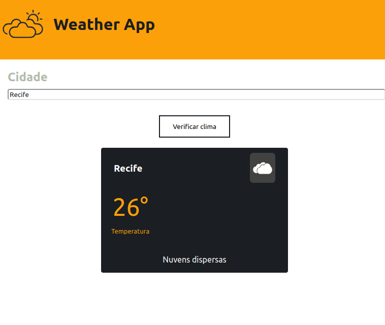

# Aplicação feita com o Create React App

This project was bootstrapped with [Create React App](https://github.com/facebook/create-react-app).

## Imagem da aplicação



## Escopo do Projeto

### Objetivo
Desenvolver uma aplicação web com React que permita ao usuário consultar as condições climáticas atuais de uma cidade, usando a API OpenWeatherMap.

### Funcionalidade Principal
1. **Consulta de Clima**
   - Permite ao usuário digitar o nome de uma cidade e clicar em um botão para obter a previsão do tempo.
   - Exibe as condições climáticas atuais da cidade solicitada, incluindo temperatura, descrição do clima e ícone correspondente.

### Tecnologias Utilizadas
- **Frontend**: React
- **API**: OpenWeatherMap
- **Estilização**: CSS
- **Ferramentas de Desenvolvimento**: Create React App, Axios

## Requisitos

- 🟩 Node.js instalado
- 📦 npm

## Passos para iniciar a aplicação

1. Clone o repositório:

   ```bash
   git clone https://github.com/RCK04/it-att4

2. Acesse a pasta:
   ```bash
   cd it-att4

3. Instale as dependências:
   ```bash
   npm install

4. Use o comando do Json Server

   ```
   json-server --watch db.json --port 3005

5. Execute a aplicação
   ```bash
   npm start

   A aplicação será aberta automaticamente e disponível em http://localhost:3000


